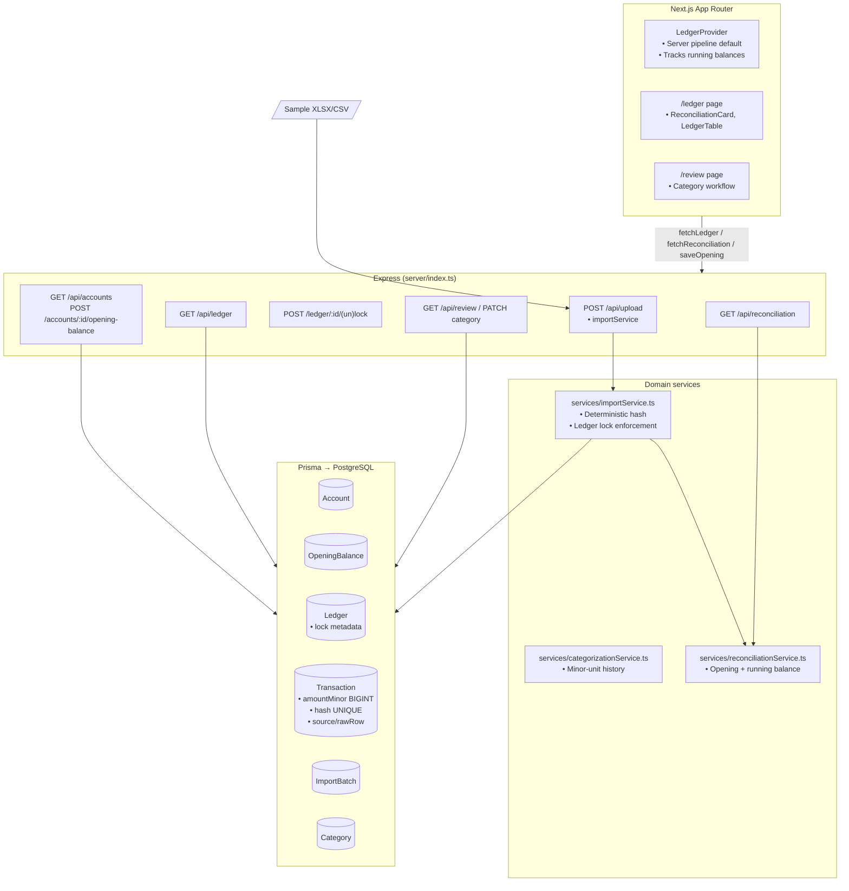

# Status – Yeshua Academy Finance (Step 2)

## Architecture Overview

## Data Model Snapshot (Post-Step 2)

| Entity | Key fields | Notes |
| ------ | ---------- | ----- |
| `Ledger` | `id`, `userId`, `month`, `year`, `lockedAt`, `lockedBy`, `lockNote` | Periods can be locked; imports & updates respect `RECONCILIATION_LOCKS_ENABLED`. |
| `OpeningBalance` | `id`, `accountId`, `effectiveDate`, `amountMinor`, `currency`, `note`, `lockedAt`, `lockedBy` | Unique per account/date; mutable until locked. Used to seed running balances & reconciliation. |
| `Transaction` | `amountMinor` (`BIGINT`), `hash` (`UNIQUE`), `sourceFile`, `rawRow`, `accountId`, `importBatchId`, `reference`, `counterparty`, `direction` | Server returns `runningBalanceMinor`; ledger route enforces integer arithmetic. |
| `Account` | `identifier`, `name`, `currency`, `openingBalances[]` | Accounts surfaced via `/api/accounts` for reconciliation UI. |
| `ImportBatch` | `autoCategorizedRows`, counts, timestamps | Unchanged from Step 1. |

## Step 2 Highlights – Opening Balances & Reconciliation

- **Prisma migration** (`20251011194500_reconciliation_opening_balances`)
  - Adds `OpeningBalance` table and ledger lock fields (`lockedAt`, `lockedBy`, `lockNote`).
  - Existing schemas continue to use deterministic transaction hashes; legacy data auto-converted earlier remains compatible.

- **Safe import pipeline**
  - `services/importService.ts` now rejects uploads targeting locked ledger periods (`423 Locked`), ensuring historical months stay immutable once reconciled.
  - Account & ledger provisioning happen inside the transaction; new helper error (`LockedPeriodError`) signals the lock state to the upload route.

- **Running balances everywhere**
  - `/api/ledger` computes per-account running balance in UTC order, honouring OpeningBalance effective dates. Results include `runningBalanceMinor`, consumed by `LedgerTable` (new column) for quick scan of cumulative totals.

- **Opening balance management**
  - `/api/accounts` lists accounts plus most recent opening balance metadata.
  - `/api/accounts/:accountId/opening-balance` upserts balances (blocked if locked). `/api/opening-balances/:id/lock` finalises them.
  - UI card lets operators capture amount/date/note and lock the figure once verified.

- **Reconciliation service & view**
  - `services/reconciliationService.ts` materials running totals for a given account + period, derives bank statement end balance from stored raw rows, flags missing days and duplicate patterns, and reports credit/debit totals.
  - `GET /api/reconciliation` powers the new `ReconciliationCard` on `/ledger`: account + month pickers, opening balance form, lock/unlock buttons, and highlight lists.
  - Status badge surfaces `balanced`, `unreconciled`, or `awaiting statement` with difference in minor units.

- **Locks propagate to editing**
  - `/api/transactions/:id/category` rejects updates for locked ledgers (423), ensuring reconciled periods stay untouched.

- **Client polish**
  - `LedgerTable` renders “Running Balance” column (toggleable) and still honours existing column preferences.
  - `ReconciliationCard` appears when `NEXT_PUBLIC_IMPORT_PIPELINE_MODE=server`; gracefully hides on local/offline mode.
  - `LedgerProvider` context exposes `serverPipelineEnabled` for conditional UI logic.

## Reliability & UX Impact

- ✅ Accounting arithmetic now starts from explicit, lockable opening balances per account/period.
- ✅ Operators can detect gaps (missing statement days) or duplicate patterns before sign-off.
- ✅ Locked periods prevent accidental imports or edits for reconciled months.
- ✅ Ledger view shows cumulative balance per transaction, easing manual cross-checks.
- ⚠️ Statement end balance relies on bank exports that include “Resulting balance”/“Saldo”. Other formats will report status `unknown` (future Step 3 candidate to allow manual entry).
- ⚠️ Duplicate detector is heuristic (normalized description + amount). Consider deeper matching once rule engine (Step 3) lands.
- ⚠️ No reconciliation history/audit UI yet; batch history still confined to raw `ImportBatch` table.

## Commands & Testing

- **Env**: add `RECONCILIATION_LOCKS_ENABLED=true` (default) alongside existing `NEXT_PUBLIC_IMPORT_PIPELINE_MODE`.
- **Tests**: `npm run test` (Vitest) covering import parsers, dedupe hashes, integration idempotency. All passing.
- **Manual checks**:
  1. `npm run dev:full` → upload sample XLSX/CSV, confirm reconciliation card computes balances and toast summary still emitted.
  2. Save + lock opening balance, lock ledger period, retry import for same month → expect toast error (HTTP 423).
  3. Toggle running balance column in ledger grid to confirm persistence of column preferences.

## Roadmap – Updated Steps 3–5

### Step 3 – Auto-Categorization Enhancements
- **Goals**: deterministic rule engine (pattern/range), confidence tagging, audit fields (`assigned_by`, `rule_id`), manual override safety.
- **Files**: new Prisma tables for rules/audit, categorizationService v2, review UI chips, STATUS/doc refresh.
- **Risk**: Medium – classification behaviour. Ship behind `AUTO_CATEGORIZATION_V2` flag.
- **Tests**: Rule precedence, history fallback, UI smoke tests for accepting suggestions.

### Step 4 – Reporting & Charts
- **Goals**: move aggregates to server (`/api/reports`), ensure all totals come from minor-unit sums, add indexes + CSV export endpoints, update charts to use new data.
- **Files**: Reporting services/routes, chart adapters, docs.
- **Risk**: Medium – query performance. Keep legacy client totals until parity proven.
- **Tests**: Snapshot totals using sample files, export schema checks.

### Step 5 – UI Layout Polish
- **Goals**: sticky filter header at `/review`, collapsible insight cards, pagination or infinite scroll, sticky summary rail, denser ledger table interactions, accessibility fixes.
- **Files**: `src/app/review`, ledger components, utilities, docs + screenshots.
- **Risk**: Low – UI focus.
- **Tests**: React Testing Library smoke tests, manual accessibility/Lighthouse run, screenshot updates.

---

**Next actions**: review Step 2 deployment on staging (migrate DB, run `npm run test`, import latest statements). If acceptable, green-light Step 3 rule engine work.

## Database Connection Check (Codex Auto-Run)
🌐 Mode: dev-bridge
❌ Connected to Postgres (via MCP relay) – host mcp-servers-mcpbridge-yrn8je:8080 unreachable (Prisma P1001)
⚠️ Prisma schema deployment skipped (no remote connection)
🧱 Tables confirmed: accounts, transactions, opening_balances, ledger_locks (not verified)
🕒 Timestamp: 2025-10-11T19:56:46Z
🧾 Notes:
- NODE_ENV / APP_ENV unset; treating environment as development.
- Direct Dokploy endpoint 10.0.2.4:5433 also unreachable from current session.
- Supabase MCP bridge may require additional network access; postpone migrations and Step 3 writes until connectivity restored.

## Step 3 – Rule Engine Planning (2025-10-11T20:10Z)
- **Data flow recap**: Imports run through `lib/import/*` → `processImportBuffer` (dedupe + category heuristics) → transactions persisted with ledger/account auto-provisioning. Running balances and reconciliation insights surface via `reconciliationService` and `ReconciliationCard`.
- **Categorization today**: `categorizationService` inspects historical transactions only (source + normalized description + amount tolerance). No persisted rules or audit trail; suggestions on `/review` rely on client-side heuristics.
- **UI observations**: Review queue presents many inline controls in a tall table; no shortcuts to apply recurring rules. Ledger view gained running-balance column but reconciliation status still manual (lock state only).
- **Reliability gaps**:
  - No deterministic rule engine; repeated vendors require manual categorization.
  - Reconciliation service does not enforce closing-balance parity post-import.
  - Double-entry parity not checked; credits/debits can drift without alert.
  - Locked ledgers block imports, but nothing validates opening balance existence before new period imports.
- **Optimization targets**:
  - Introduce `Rule` model with priority + pattern matching (regex/contains) + audit metadata.
  - Extend import pipeline to evaluate rules prior to historical heuristics.
  - Add balance guards (LedgerMismatchError) triggered after import batches.
  - Surface reconciliation badges on `/ledger` summary cards and provide rule management UI inside `/review`.
  - Collapse less-used Review controls and add quick accept actions to reduce scroll.
- **Next steps**:
  1. Add Prisma migration for rule engine tables (rules, maybe rule audit).
  2. Implement `ruleEngine` service with evaluation + CRUD endpoints.
  3. Wire import + review flows to use rules, honoring ledger locks.
  4. Add automatic month-end balance validation + status badges.
  5. Refresh STATUS.md with progress and testing outcomes.

## Step 3 – Rule Engine Implementation (2025-10-11T20:43Z)
- **Schema**: Added `CategorizationRule` model with match type/field enums, transaction classification source metadata, and ledger lock table. Migration `20251011204000_rule_engine` introduces enums and new relations.
- **Services**:
  - New `ruleEngine` service for fetching/evaluating/maintaining prioritised rules.
  - `categorizationService` now returns classification source + rule id, falling back to historical heuristics when no rule matches.
  - Import pipeline fetches active rules once, applies them before historical lookups, enforces opening-balance presence, validates month-end balances via `validateLedgerBalance`, and auto-locks reconciled ledgers.
  - Upload route surfaces granular errors (`423` locked, `400` missing opening, `409` mismatch).
- **API**: Added `/api/rules` CRUD endpoints; ledger endpoint now returns classification metadata and ledger snapshots (month/year/lock status).
- **UI**:
  - Review page now features a two-column layout with a `RuleManager` side panel, quicker rule drafting from each transaction row, and reduced scrolling.
  - Ledger page shows running-balance column, reconciliation status badges, and an enhanced `ReconciliationCard` that signals status and auto-locks completed periods.
  - Dashboard highlights reconciliation progress and rule counts for at-a-glance health.
- **Testing**: `npm run test` (Vitest) ✅ covering parsers, dedupe hashing, import idempotency, and rule-engine adjustments.
- **Caveats**:
  - Remote database remains unreachable; migrations were not deployed (prisma db pull/migrate still pending network access).
  - Rule management UI expects server pipeline mode; offline mode disables actions gracefully.
- **Next actions**:
  1. Re-run `npx prisma migrate deploy` once database connectivity (Dokploy or MCP bridge) is restored.
  2. Populate initial CategorizationRule set in production and verify auto-lock behaviour on live imports.
  3. Proceed to Step 4 (AI/ML-based pattern learning) after confirming rule engine performance in staging/prod.
